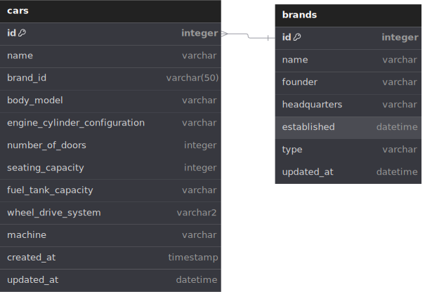

# CARS API

Cars API for listing various cars.

## REST API Specification

- Production: <https://cars-api.josapratama.com>
- Local: <http://localhost:3000>

| Endpoint     | HTTP     | Description          | Implemented |
| ------------ | -------- | -------------------- | ----------- |
| `/cars`      | `GET`    | Get all cars         | ✅          |
| `/cars/:id`  | `GET`    | Get one car by id    | ✅          |
| `/cars`      | `POST`   | Add new car          | ✅          |
| `/cars`      | `DELETE` | Delete all cars      | ✅          |
| `/cars/:id`  | `DELETE` | Delete one car by id | ✅          |
| `/cars/:id`  | `PUT`    | Update one car by id | ✅          |
| `/cars/seed` | `POST`   | Seed many cars       | ✅          |

## ERD



## Getting Started

To install dependencies:

```sh
bun install
```

To run:

```sh
bun run dev
```

```sh
bun dev
```

Open <http://localhost:3000>
